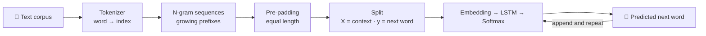

<div align="center">

# ⌨️ Next Word Predictor using LSTM

**A deep learning language model that predicts the next word in a sentence and generates text one word at a time, built from scratch with TensorFlow / Keras.**

[](https://colab.research.google.com/github/aqdas-rehman/Next-Word-Predictor-using-LSTM/blob/main/Next_Word_Predictor_Using_Lstm.ipynb)


</div>

---

## 📌 Overview

Next-word prediction is the idea behind keyboard suggestions and auto-complete. Given the words typed so far, the model estimates which word is most likely to come next.

This project walks through the complete NLP pipeline end to end: turning raw text into numeric sequences, building training pairs, training an **Embedding + LSTM** network, and using it to generate new text word by word.

## ✨ Features

- 🔤 **Tokenization**: every word is mapped to an index with the Keras `Tokenizer`
- 🧱 **N-gram sequence generation**: each sentence is expanded into growing prefixes (`w1 w2`, `w1 w2 w3`, …) to create many training samples
- 📏 **Pre-padding**: sequences are padded to equal length so they can be batched
- 🧠 **LSTM language model**: Embedding layer, LSTM layer and a softmax output over the vocabulary
- ✍️ **Text generation**: predicts a word, appends it to the input and repeats to complete a sentence

## 🧠 How It Works



**Example of how training pairs are built** from one sentence:

| Input (X) | Target (y) |
|---|---|
| `w1` | `w2` |
| `w1 w2` | `w3` |
| `w1 w2 w3` | `w4` |

## 🏗️ Model Architecture

```python
model = Sequential()
model.add(Embedding(455, 100))          # word index → 100-dim dense vector
model.add(LSTM(150))                    # learns word order / context
model.add(Dense(455, activation='softmax'))   # probability of every word in the vocabulary
```

| Setting | Value |
|---|---|
| Vocabulary size | 454 words (+1 for padding = 455) |
| Embedding dimension | 100 |
| LSTM units | 150 |
| Output layer | Dense (455) with softmax |
| Loss | Categorical cross-entropy |
| Optimizer | Adam |
| Epochs | 50 (Keras default batch size, 32) |
| Training samples | 1,170 sequences |
| Max sequence length | 41 |

## 📊 Results

- Training accuracy rises from about **2%** in the first epoch to about **93.5%** after 50 epochs.
- The model completes a seed sentence one word at a time:

```
Input : Aqdas is a Data Science graduate
Output: Aqdas is a Data Science graduate and ai enthusiast with a strong interest in machine learning
```

> ⚠️ The dataset is a small custom text, so this accuracy is *training* accuracy and mostly shows that the model has learned the corpus. See [Limitations](#️-limitations).

## 🛠️ Tech Stack

`Python` · `TensorFlow` · `Keras` · `NumPy` · `Jupyter / Google Colab`

## 🚀 Getting Started

### Google Colab (recommended)

Click the **Open in Colab** badge at the top and run all cells.

### Run locally

```bash
# 1. Clone the repository
git clone https://github.com/aqdas-rehman/Next-Word-Predictor-using-LSTM.git
cd Next-Word-Predictor-using-LSTM

# 2. Install dependencies
pip install tensorflow numpy jupyter

# 3. Open the notebook
jupyter notebook Next_Word_Predictor_Using_Lstm.ipynb
```

## ▶️ Usage

After training, generate text from any seed phrase:

```python
text = "Aqdas is a Data Science graduate"

for i in range(10):                                   # number of words to generate
    token_text = tokenizer.texts_to_sequences([text])[0]
    padded = pad_sequences([token_text], maxlen=max_len - 1, padding='pre')
    pos = np.argmax(model.predict(padded))            # index of the most likely next word
    for word, index in tokenizer.word_index.items():
        if index == pos:
            text = text + " " + word
print(text)
```

## 📁 Project Structure

```
Next-Word-Predictor-using-LSTM/
├── Next_Word_Predictor_Using_Lstm.ipynb   # Tokenization → sequences → LSTM model → text generation
└── README.md
```

## ⚠️ Limitations

- The training text is very small (454 unique words), so the model largely memorises it and will mostly reproduce phrases from the corpus.
- There is no validation split, so the reported accuracy does not measure how well the model generalises.
- Prediction always takes the single most likely word (argmax), which makes the output deterministic and repetitive.
- Words that are not in the vocabulary are ignored at prediction time.

## 🔮 Future Improvements

- [ ] Train on a larger public corpus (e.g. WikiText-2, news or Shakespeare text)
- [ ] Add a train / validation split and report perplexity and top-k accuracy
- [ ] Show the top 3–5 suggestions, like a phone keyboard, instead of only one word
- [ ] Add temperature / top-k sampling for more varied text generation
- [ ] Compare against GRU, Bidirectional LSTM and Transformer models
- [ ] Save the model and tokenizer, then wrap them in a Gradio or Streamlit auto-complete demo

## 👤 Author

**Aqdas Rehman**: AI/ML & Automation Engineer
GitHub: [@aqdas-rehman](https://github.com/aqdas-rehman)

---

<div align="center">

⭐ If you found this project useful, consider giving it a star!

</div>
